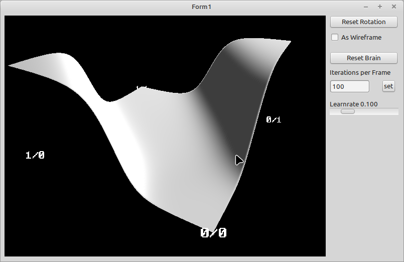

# 92 - XOR Problem

In his book [The nature of Code](https://natureofcode.com/) Dan developes a neural network engine in chapter 10. You can watch the series [here](https://www.youtube.com/playlist?list=PLRqwX-V7Uu6aCibgK1PTWWu9by6XFdCfh).

In this [video](https://www.youtube.com/watch?app=desktop&v=188B6k_F9jU&t=0s) he is testing wheather the network is able to "learn" the XOR function.

To be able to compile this example you need to download:

- [uneuralnetwork.pas](https://github.com/PascalCorpsman/Examples/blob/master/data_control/uneuralnetwork.pas)
- [uvectormath.pas](https://github.com/PascalCorpsman/Examples/blob/master/data_control/uvectormath.pas)
- [dglOpenGL.pas](https://github.com/SaschaWillems/dglOpenGL/blob/master/dglOpenGL.pas)
- [uopengl_ascii_font.pas](https://github.com/PascalCorpsman/Examples/blob/master/OpenGL/uopengl_ascii_font.pas)
- [uopengl_ascii_font.ressource](https://github.com/PascalCorpsman/Examples/blob/master/OpenGL/uopengl_ascii_font.ressource)
- install LazOpenGLControl into the Lazarus IDE

