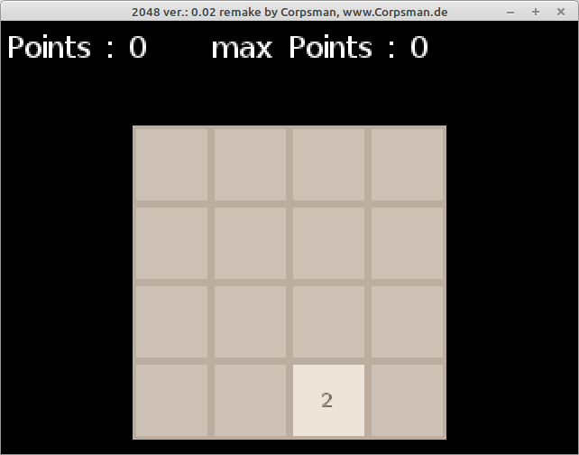

# 94 - 2048

In this video Daniel implements the famous 2048 game.

Here are the links to the videos [Part1](https://www.youtube.com/watch?v=JSn-DJU8qf0) and [Part2](https://www.youtube.com/watch?v=8f8P1i0W26E)

As I already did this in the past before creating this repository i will give here the link to my [2048](https://github.com/PascalCorpsman/mini_projects/tree/main/miniprojects/2048) project in the mini projects repository, which shows a improved implementation (including a "random" ai).

