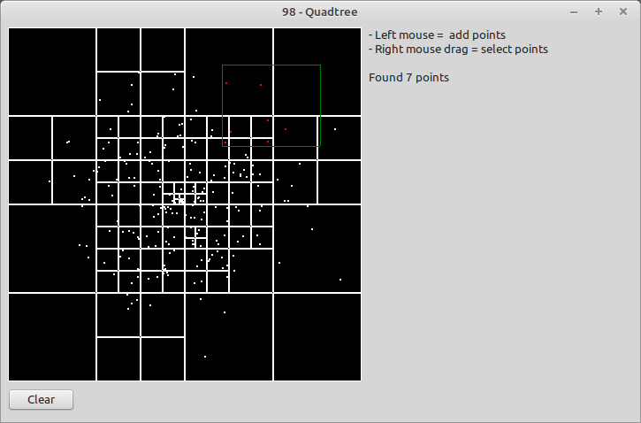
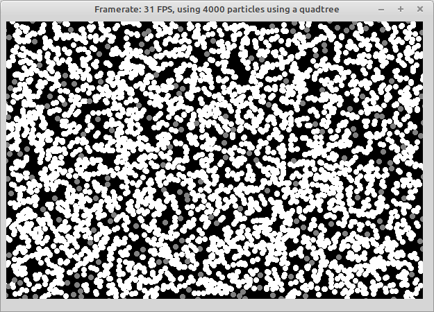

# 98 - QuadTree

Daniel implements a Quadtree class to select / and organize 2D points

The challange is split up into 3 videos
- [Part1](https://www.youtube.com/watch?v=OJxEcs0w_kE)
- [Part2](https://www.youtube.com/watch?v=QQx_NmCIuCY)
- [Part3](https://www.youtube.com/watch?v=z0YFFg_nBjw)

In Part 3 Daniel is proofing the efficiency of the implementation, by calculating collissions between "particles".
Use the

> {.$DEFINE QuadTreeVersion}

switch to test the version with and without the quadtree.

