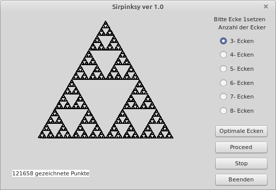

# 123 - Chaos game

Dan implements a engine that creates sirpinsky figures by doing "random" point plottings

The challange is split up into 2 videos
- [Part1](https://www.youtube.com/watch?v=7gNzMtYo9n4)
- [Part2](https://www.youtube.com/watch?v=A0NHGTggoOQ)

