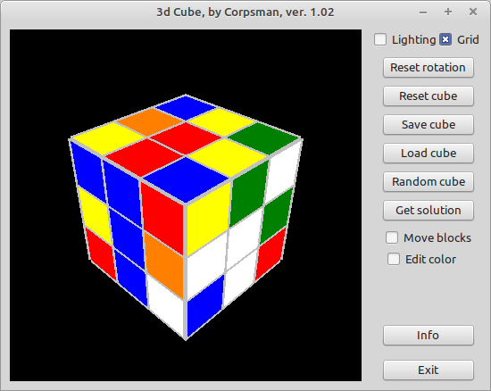

# 142 - Rubik's Cube

Daniel implements a rubic cube renderer that is able to rotate the rubic cube on the screen

The challange is split up into 3 videos
- [Part1](https://www.youtube.com/watch?v=9PGfL4t-uqE)
- [Part2](https://www.youtube.com/watch?v=EGmVulED_4M)
- [Part3](https://www.youtube.com/watch?v=8U2gsbNe1Uo)

also related:
- [174](https://www.youtube.com/watch?v=GbHGGYSwVvY&t=7318s) Rubik's Cube continued..

My version also provides a solving animation to any valid shuffled cubes

To be able to compile this example you need to download:

- [uvectormath.pas](https://github.com/PascalCorpsman/Examples/blob/master/data_control/uvectormath.pas)
- [ufifo.pas](https://github.com/PascalCorpsman/Examples/blob/master/data_control/ufifo.pas)
- [ugraphics.pas](https://github.com/PascalCorpsman/Examples/blob/master/graphics/ugraphics.pas)
- [uopengl_graphikengine.pas](https://github.com/PascalCorpsman/Examples/blob/master/OpenGL/uopengl_graphikengine.pas)
- [dglOpenGL.pas](https://github.com/SaschaWillems/dglOpenGL/blob/master/dglOpenGL.pas)
- install LazOpenGLControl into the Lazarus IDE

