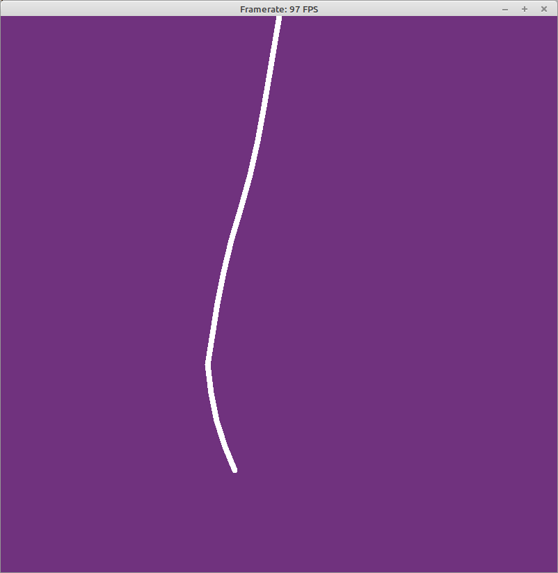

# 160 - Spring forces

In this [video](https://www.youtube.com/watch?v=Rr-5HiXquhw) Daniel implements a spring force engine

To be able to compile this example you need to download:

- [uvectormath.pas](https://github.com/PascalCorpsman/Examples/blob/master/data_control/uvectormath.pas)
