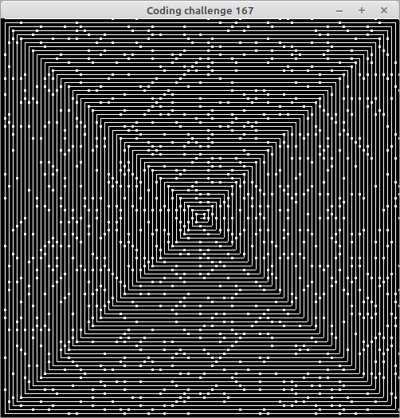

# 167 - Ulam spiral of prime numbers

In this [video](https://www.youtube.com/watch?v=a35KWEjRvc0) Daniel implements the ulam spiral of prime numbers.

To challenge myself i tried to code it as "same" as possible, by emulating all the p5 commands ;)
