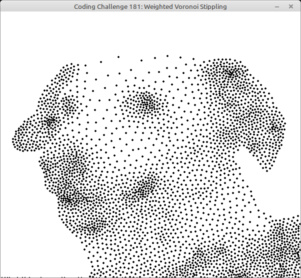

# 181 - Weighted Voronoi Stippling

In this [video](https://www.youtube.com/watch?v=Bxdt6T_1qgc) Daniel implements the a weighted voronoi stippling algorithm to render his dog gloria.

To challenge myself i tried to code it as "same" as possible, by emulating all the p5 commands ;). But as i do not have a portation of the [d3-delaunay](https://d3js.org/d3-delaunay) library by hand, i used uvectormath.pas instead.

To be able to compile this example you need to download:

- [uvectormath.pas](https://github.com/PascalCorpsman/Examples/blob/master/data_control/uvectormath.pas)

